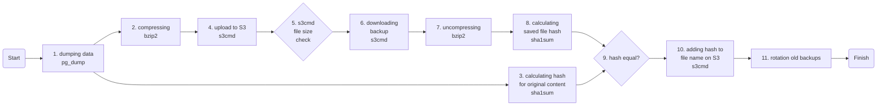

# kubernetes-backup-cronjob
CronJob with container for kubernetes to backup external databases to S3 or other destinations.

Project State: In Progress

Writed on Go, it has pipe flows without any temporary files to upload database backup directly to destination. 

Supported:
1. [ ] Compressing
2. [ ] encryption (asymmetric with public key)
3. [ ] consistency check (based on SHA1 hash)
4. [ ] check for resulting backup file size
5. [ ] rotation old backups

Source: <b>PostgreSQL</b> 
Destination: <b>S3</b> 

Tests List:
1. [ ] dumping failed
1. [ ] compressing failed
3. [ ] source content hashing failed
4. [ ] uploading failed
5. [ ] resulting file size is too small (backup not created correctly)
6. [ ] downloading failed
7. [ ] uncompressing failed
8. [ ] destination content hashing failed
9. [ ] hashes of uploaded and downloaded files are not match (consistency check failed)
10. [ ] renaming failed
11. [ ] rotation of old backup faield
